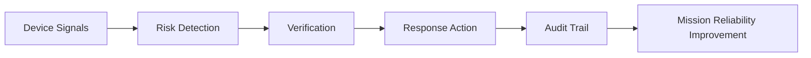
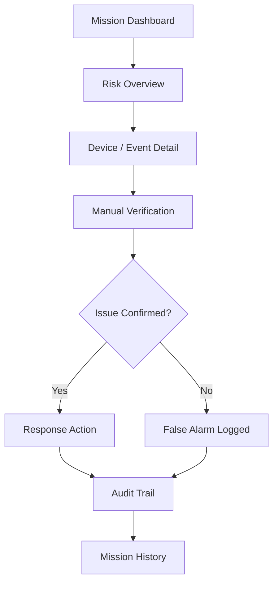

# Mission Reliability Project

## When "Online" Isn't Reliable

### Building the Mission Reliability Layer for High-Risk Connected Devices

> Connected devices should not only appear online.  
> They should be trustworthy when they matter most.

---

## Product Vision

### Beyond After-Action Reviews: Predicting and Preventing Failures Before They Happen

In high-risk environments, a connected device being **online** does not always mean it is reliable.

A body camera may show online status but silently freeze.  
A sensor may remain connected but stop reporting meaningful data.  
A device may appear operational while failing to capture critical evidence.

In these situations, the failure is not simply technical.

It becomes a:

- Trust problem
- Liability problem
- Evidence integrity problem
- Operational continuity problem

Mission-critical devices are no longer just tools.

They are essential components of:

- Evidence collection
- Compliance auditing
- Emergency response
- Field operations
- Mission success

This project introduces the **Mission Reliability Layer**:

A reliability intelligence layer that ensures every deployed device is:

- Functional
- Traceable
- Verifiable
- Recoverable

throughout a mission.

---

## The Problem

### The Hidden Failure Behind "Online"

Traditional monitoring systems answer:

> "Is the device connected?"

But high-risk operations require a different question:

> "Will this device work when the mission depends on it?"

Connected devices can still:

- Freeze silently
- Stop recording
- Lose synchronization
- Fail to trigger
- Fail to upload critical data

while reporting a healthy online state.

The real vulnerability is not device availability.

It is:

> **Device integrity at the critical moment.**

---

## Product Concept

### Mission Reliability = Detection + Verification + Recovery + Audit

Unlike traditional monitoring platforms that focus on:

- Device uptime
- Basic health status
- Post-incident debugging

Mission Reliability proactively identifies operational risks before failure occurs.

The platform connects:

- Command center operators
- Frontline personnel
- Connected devices

to create a closed reliability workflow:



---

## Users

### Command Center Crew

#### Goal

Identify mission risks and prevent failures before critical operations begin.

#### They use:

- Mission dashboard
- Risk prioritization
- Device health overview
- Verification workflow
- Response coordination

---

### In-Field Personnel

#### Goal

Ensure equipment readiness and preserve mission integrity.

#### They use:

- Mobile application
- Connected devices / body cameras
- Automated pre-check workflows
- Evidence reliability verification

---

## Core Insight

### The Problem Is Not Whether a Device Exists

The real question is:

> Whether the device is actually functional when it matters.

A successful reliability system should:

- Expose risks before failure occurs
- Protect mission continuity
- Preserve evidence integrity
- Provide recovery workflows when anomalies happen

---

# User Flow

## Command Center Reliability Workflow

| Screen | User Goal | User Actions | System Outcome |
|---|---|---|---|
| Mission Group Dashboard | Understand overall mission health | View active groups, trust status, risk severity, affected missions, recent actions, filter and sort missions | Opens group detail or updates dashboard view |
| Group Detail / Risk Overview | Identify the source of risk | Review device signals, flagged events, action logs, team notes, select device/event | Opens device detail, event detail, verification panel, or response panel |
| Manual Verification Panel | Confirm whether the issue is real | Run device checks, contact field officer, review logs, check history, mark status | Updates risk status as confirmed, unresolved, or false alarm |
| Response Action Panel | Recover mission readiness | Swap device, reassign personnel, restart recording, switch channel, escalate support | Executes recovery action and records audit trail |
| Retired Mission History | Learn from previous operations | Review archived missions, incidents, reports, and historical actions | Supports future reliability improvement |

---

## User Flow Diagram



---

## Reliability Simulation

### Objective

Validate how device reliability affects:

- Customer trust
- Adoption probability
- Commercial impact

---

## Simulation Assumptions

### Core User Behavior

- 70% of flagged risks complete the full workflow:
  - Verify
  - Respond
  - Log

- Closure rate stabilizes at 59.5% after operational habits mature.

---

### Detection Time Distribution

Detection time follows a realistic fleet distribution.

Assumptions:

- Median detection time: 4 minutes
- P90 detection time: 8.1 minutes

The model evaluates fleet-level reliability instead of assuming every device behaves identically.

---

### Failure Risk Model

Assumptions:

- 8% of devices experience fake-online events annually
- 25% are genuine hardware defects
- Hardware defects are excluded from trust calculation
- Baseline auto-detection rate: 92%

---

## Base Case Results

| Metric | Value |
|---|---:|
| Median detection time | 4.0 min |
| P90 detection time | 8.1 min |
| Cases over 10 min | 4.8% |
| Active Phase | Healthy |
| Trust score | 85% |
| Conversion rate | 75% |
| Pilot-year revenue | $5.75M |
| Enterprise-year revenue | $5.625M |

---

## Sensitivity Analysis

### Detection Speed Degradation

| Scenario | Impact |
|---|---|
| 4 min median detection | Healthy |
| 8 min median detection | Still stable |
| >30% slow cases | Warning phase triggered |
| Revenue impact | -27% |

### Insight

Speed affects operational efficiency.

However, trust remains stable until fleet behavior crosses a meaningful threshold.

---

### Detection Accuracy Degradation

| Auto Detection Rate | Result |
|---|---|
| 90% | Healthy |
| 85% | Critical phase triggered |

A small change:

```
90% → 85%
```

creates:

```
Manual catch rate:
10% → 15%
```

Result:

- Trust collapse
- Lower conversion
- Revenue decreases by 67%

---

## Key Product Insight

### Accuracy Matters More Than Speed

A slow system creates frustration.

A system that silently fails destroys trust.

The most dangerous failure mode is:

> Humans discovering failures during incidents instead of the system detecting them beforehand.

This directly violates the product promise:

> "Failure caught before it mattered."

---

## Product Principles

### Principle 1: Prevent Silent Failures Before Users Notice

Reliability starts before incidents happen.

---

### Principle 2: Guide Operators Through Recovery

Detection alone is insufficient.

Operators need clear next actions.

---

### Principle 3: Make Every Recovery Auditable

Every verification and response action becomes part of the mission record.

---

## Prototype

Live Prototype:

https://maudes.github.io/mission-reliability-project/group-detail.html

---

## Why Me

### Asymmetric Advantage

My advantage comes from operating at the intersection of:

- IoT hardware
- Network infrastructure
- Cloud platforms
- User-facing applications

I have led:

- Million-scale smart device products
- Google Home ecosystem integrations
- Amazon Alexa integrations
- Apple Home integrations
- European Tier-1 telecom operator partnerships
- Networking ODM collaborations

---

## Unique Perspective

Most teams treat these as separate problems:

### Layer 3 Network Diagnostics

and

### Layer 7 User Experience

My approach connects both.

I design reliability systems that transform hidden failures into:

- Observable problems
- Diagnosable signals
- Recoverable workflows

---

## Why This Matters Now

Connected devices are becoming mission-critical across:

- Government
- Public safety
- Healthcare
- Manufacturing
- Enterprise infrastructure

The next generation of IoT products will not compete only on connectivity.

They will compete on:

## Trust.

---

## Closing

Mission Reliability is not another monitoring dashboard.

It is a new reliability layer for high-risk connected operations.

Because being online is not enough.

Devices must be reliable when they matter most.
